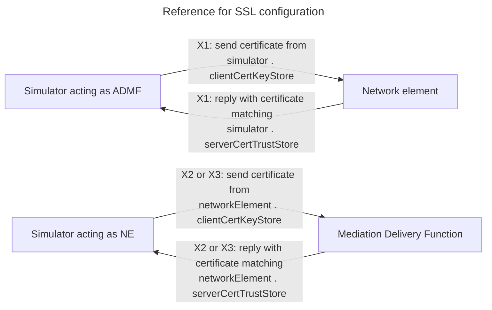
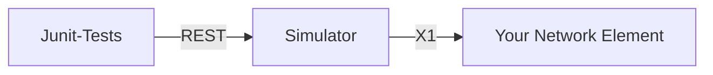

# li-simulator-x1x2x3


Human-friendlier interface to interact with a X1/X2/X3 node. Intended to test the ETSI TS 103 221 implementations of
Network Elements.

This repository contains tests that validate the behaviour of Simulator against a stable network element (which is
provided by a Wiremock instance with Stubs). These tests can then also be used to validate a moving/in-development
implementation of X1/X2/X3.

This simulator implements an ADMF and MDF and uses
our [li-library for X1/X2/X3](https://github.com/sipgate/li-lib-x1x2x3/)

## Local development

1. `git clone` the repository
2. Run `npm install` for git hooks and prettier (code formatting)
3. For TLS setup and running the simulator, run `docker compose up --build`

The API documentation is available at `http://localhost:8080/swagger-ui.html`.

## Docker tags

In general, there are two kinds of docker images:

1. The runtime of the simulator. They are called like `latest`, `1.0.0`, `1.0.0-SNAPSHOT`.
2. The tests for the simulator. They are suffixed with `-tests`, e.g. `latest-tests` or `1.0.0-tests`

You probably only want to use the runtime.

For running tests, see [Validating your own NE](#validating-your-own-network-element).

## Configuring the simulator

The docker-compose files in the [Github repository](https://github.com/sipgate/li-simulator) provide sane defaults and a
Wiremock network element to test against.

The simulator can be configured by environment if needed (e.g. to talk to a "real" network element):

### SIPGATE_LI_SIMULATOR_TARGETURI

**Description:** The URL of the Network Element  
**Default Value:** `https://localhost/X1/NE`

### SIPGATE_LI_SIMULATOR_ADMFIDENTIFIER

**Description:** The ID of the simulated ADMF  
**Default Value:** `admf-id`

### SIPGATE_LI_SIMULATOR_CLIENTCERTKEYSTORE_PATH

**Description:** The Path to the keystore holding the client TLS cert of the ADMF. This certificate is presented to the
NE.  
**Default Value:** `/tmp/keystore.p12`

### SIPGATE_LI_SIMULATOR_CLIENTCERTKEYSTORE_PASSWORD

**Description:** The password for the above-mentioned file  
**Default Value:** `changeit`

### SIPGATE_LI_SIMULATOR_SERVERCERTTRUSTSTORE_PATH

**Description:** The Path to the truststore. Must contain a valid cert of the network element.  
**Default Value:** `/tmp/truststore.jks`

### SIPGATE_LI_SIMULATOR_SERVERCERTTRUSTSTORE_PASSWORD

**Description:** The password for the above-mentioned file  
**Default Value:** `changeit`

### SIPGATE_LI_SIMULATOR_X2X3SERVER_SSLENABLED

**Description:** Use this to enable or disable SSL for the X2X3 part of the MDF.  
**Default Value:** `true`

### SIPGATE_LI_SIMULATOR_X2X3SERVER_PORT

**Description:** The TCP port to listen to for X2/X3 streams  
**Default Value:** `42069`

### SIPGATE_LI_SIMULATOR_X2X3SERVER_MAXHEADERLENGTH

**Description:** The maximum length in bytes of the X2/X3 packet header  
**Default Value:** `320`

### SIPGATE_LI_SIMULATOR_X2X3SERVER_MAXPAYLOADLENGTH

**Description:** The maximum length in bytes of the X2/X3 packet payload  
**Default Value:** `8192`

### SIPGATE_LI_NETWORKELEMENT_CLIENTCERTKEYSTORE_PATH

**Description:** The path of the client keystore of the simulated network element. This is used for the route
`POST /sip`. This triggers the simulator to connect to itself and deliver an X2 PDU. We used that to validate our own
li-lib encoders and decoders.  
**Default Value:** `/mutual-tls-stores/network-element-keystore.p12`

### SIPGATE_LI_NETWORKELEMENT_CLIENTCERTKEYSTORE_PASSWORD

**Description:** The password for the above-mentioned file  
**Default Value:** `changeit`

### SIPGATE_LI_NETWORKELEMENT_SERVERCERTTRUSTSTORE_PATH

**Description:** The truststore containing the MDF server public cert  
**Default Value:** `/mutual-tls-stores/network-element-truststore.jks`

### SIPGATE_LI_NETWORKELEMENT_SERVERCERTTRUSTSTORE_PASSWORD

**Description:** The password for the above-mentioned file  
**Default Value:** `changeit`



## Preparing a new release

We're using the [Maven release plugin](https://maven.apache.org/maven-release/maven-release-plugin/index.html).
When ready, run `./mvnw release:prepare -Dresume=false` and follow the instructions. This will create, tag and push a
new release.

## Run end-to-end tests

Run e2e-tests via `./scripts/run-e2e-tests.sh`

For details about test scenarios within wiremock, see
[Network Element README](https://github.com/sipgate/li-simulator/docker/network-element/README.md)

### Validating your own network element

To validate your own network element, you can use the tests in this repository with maven, or you can use the `tests`
docker images.

When running the tests, you must have a running simulator instance,
see [Configuring the simulator](#configuring-the-simulator) how to connect the simulator to your network element.

For the tests, you have to set the system properties `serviceHost` and `servicePort` to connect to your local simulator
instance.

#### Using maven

The tests are written in Java and are published to Maven Central. You can include them in your project by adding the
following dependencies:

```xml

<dependencies>
  <dependency>
    <groupId>com.sipgate</groupId>
    <artifactId>li-simulator</artifactId>
    <version>1.0.2</version>
    <scope>test</scope>
  </dependency>

  <dependency>
    <groupId>com.sipgate</groupId>
    <artifactId>li-simulator</artifactId>
    <version>1.0.2</version>
    <scope>test</scope>
    <classifier>tests</classifier>
    <type>test-jar</type>
  </dependency>
</dependencies>
```

#### Using docker

```shell
docker run \
  --rm \
  sipgategmbh/li-simulator-x1x2x3:latest-tests \
  -DserviceHost=simulator.example.org  \
  -DservicePort=8080
```

### Test setup



The dependency above will provide the JUnit tests and those will talk to the REST API of the LI ADMF simulator. The
simulator will then talk to your NE via X1. Thus, you will also need a running instance of the Simulator.
See [Configuring the simulator](#configuring-the-simulator) for more details on how to configure the simulator backend
to talk to your Network Element instead.

### Mutual TLS for your own NE

The simulator fully supports using mTLS authentication and encryption. If you need to generate certificates for local
testing, have a look at the provided docker-compose setup in this Github repo. We're using init-containers to create
self-signed client and server certs, key stores and trust stores for our Mock setup to use. You can adapt this for your
own testing purposes.

## Send X2/X3 packet to the simulator MDF

Start the simulator environment using docker. There is a binary x2 file in `src/test/misc/x2-demo-01.bin` that you can
copy into the container and then send to the server:

```shell
docker compose cp src/test/misc/x2-demo-01.bin simulator:/tmp/x2-demo-01.bin

docker compose exec -i simulator \
  /bin/bash -c "cat /tmp/x2-demo-01.bin | openssl s_client \
    -connect 127.0.0.1:42069 \
    -cert /mutual-tls-stores/certs/network-element.crt \
    -key /mutual-tls-stores/keys/network-element.key"
```

## Retrieving X3 RTP Audio

The simulator can be used to dump all received RTP audio packets and create an MP3. To do this, send your RTP stream via
X3 to the simulator on port 42069.
It is out of scope how you do this - use your NE for example.

Given `ffmpeg` in PATH, and after you have sent the RTP stream, you can retrieve the audio by using the following
commands:

```shell
python3 -m venv .venv
source .venv/bin/activate
pip3 install -r scripts/requirements.txt
python3 scripts/download-x3rtp-and-convert.py http://localhost:8080 [XID] [in|out]
```

Replace `[XID]` with the XID of the call you want to retrieve and `[in|out]` with the direction of the call. The script
will download the RTP packets and convert them to an MP3 file called `[XID]-[DIRECTION].mp3`.

Be sure to reset the X2X3 in-memory receiver after you have downloaded the audio.

```shell
curl -X POST "http://localhost:8080/x2x3/reset"
```

## Further information

- EVE Explains: ETSI TS 103 221 - X1/X2/X3 https://www.lawfulinterception.com/explains/etsi-ts-103-221/

## Security Disclosure

If you find any vulnerabilities in our software, please refer
to [sipgate's security team](https://www.sipgate.de/.well-known/security.txt)
who will coordinate a disclosure with you. Thanks for reporting any issues.
