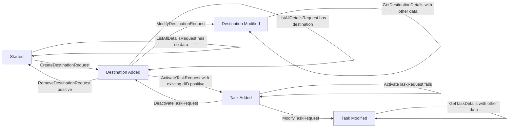

# State Machines for Scenarios

Wiremock responds differently, based on matches to the request and depending on the current State Machine state. Having
called a specific request can move the State Machine to another state (i.e., after creating a destination, you can get
the destination).

See more information [in the Wiremock docs](https://wiremock.org/docs/stateful-behaviour/).

## Check Destination Details and Task

The State Machine simulates the different states that a X1 Network elements can have.

To restart a scenario, send an empty POST to `/__admin/scenarios/reset`. You are back to Scenario `Started` after that.

