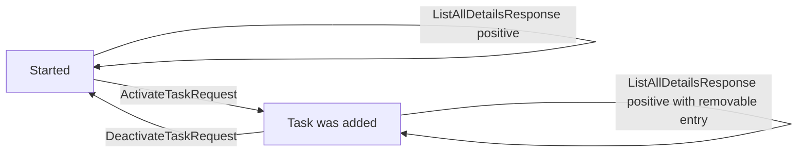
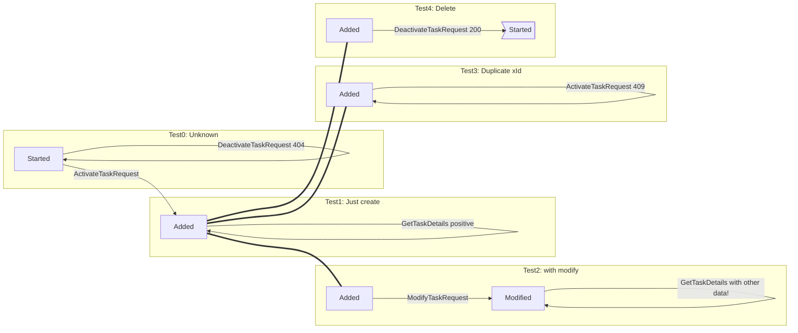

# State Machines for Scenarios

To restart a scenario, send an empty PUT to /\_\_admin/scenarios/my_scenario/state.

## Remove Added Task

```mermaid
flowchart LR
  started["Started"] --ActivateTaskRequest--> added["Task was added"]

  started --"ListAllDetailsResponse positive"--> started

  added --"ListAllDetailsResponse positive with removable entry" --> added

  added --"DeactivateTaskRequest"--> started
```

## Check Task Details

```mermaid
flowchart LR

  subgraph Test0: Unknown
    started
  end

  subgraph Test1: Just create
    added
  end

  subgraph Test2: with modify
    added1["Added"]
    modified
  end

  subgraph Test3: Duplicate xId
    added2["Added"]
  end

  subgraph Test4: Delete
    added3["Added"]
    empty>"Started"]
  end


  started["Started"] --ActivateTaskRequest--> added["Added"]

  started --"GetTaskDetails 404" --> started
  started --"ModifyTaskRequest 404" --> started
  started --"DeactivateTaskRequest 404" --> started

  added --"GetTaskDetails positive" --> added

  added === added1
  added1 --ModifyTaskRequest--> modified["Modified"]
  modified --"GetTaskDetails with other data!" --> modified

  added === added2
  added2 --"ActivateTaskRequest 409" --> added2

  added === added3
  added3 --"DeactivateTaskRequest 200" --> empty
```
