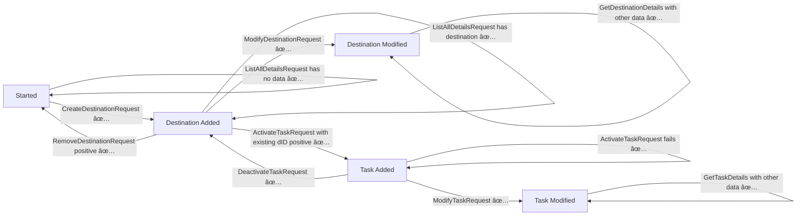

# State Machines for Scenarios

To restart a scenario, send an empty POST to /\_\_admin/scenarios/reset.

## Check Destination Details and Task

✅ = done
👀 = in progress

```mermaid
flowchart LR
  started["Started"] --"CreateDestinationRequest ✅"--> destination_added["Destination Added"]
  started --"GetDestinationDetails fails ✅" --> started
  started --"ModifyDestinationRequest fails ✅" --> started
  started --"RemoveDestinationRequest fails ✅" --> started
  started --"ActivateTaskRequest with unknown dID fails ✅"--> started
  started --"ListAllDetailsRequest has no data ✅" --> started
  destination_added --"GetDestinationDetails positive  ✅" --> destination_added
  destination_added --"ModifyDestinationRequest ✅"--> destination_modified["Destination Modified"]
  destination_modified --"GetDestinationDetails with other data ✅" --> destination_modified
  destination_added --"CreateDestinationRequest fails ✅" --> destination_added
  destination_added --"RemoveDestinationRequest positive ✅" --> started
  destination_added --"ActivateTaskRequest with existing dID positive ✅"-->task_added["Task Added"]
  task_added --"RemoveDestinationRequest fails (depending task) ✅"--> task_added
  task_added --"DeactivateTaskRequest ✅"--> destination_added
  destination_added --"GetTaskDetails fails ✅" --> destination_added
  destination_added --"ModifyTaskRequest fails ✅" --> destination_added
  destination_added --"DeactivateTaskRequest fails ✅" --> destination_added
  destination_added --"ListAllDetailsRequest has destination ✅" --> destination_added
  task_added --"GetTaskDetails positive ✅" --> task_added
  task_added --"ListAllDetailsRequest has task and destination ✅" --> task_added
  task_added --ModifyTaskRequest ✅--> task_modified["Task Modified"]
  task_modified --"GetTaskDetails with other data ✅" --> task_modified
  task_added --"ActivateTaskRequest fails ✅" --> task_added

```
